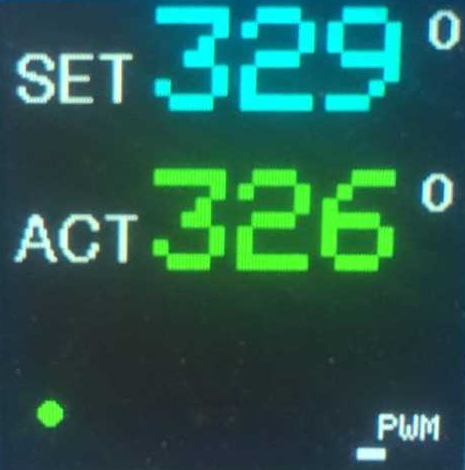
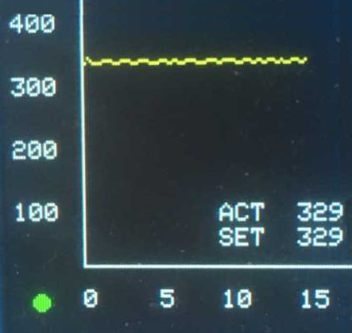
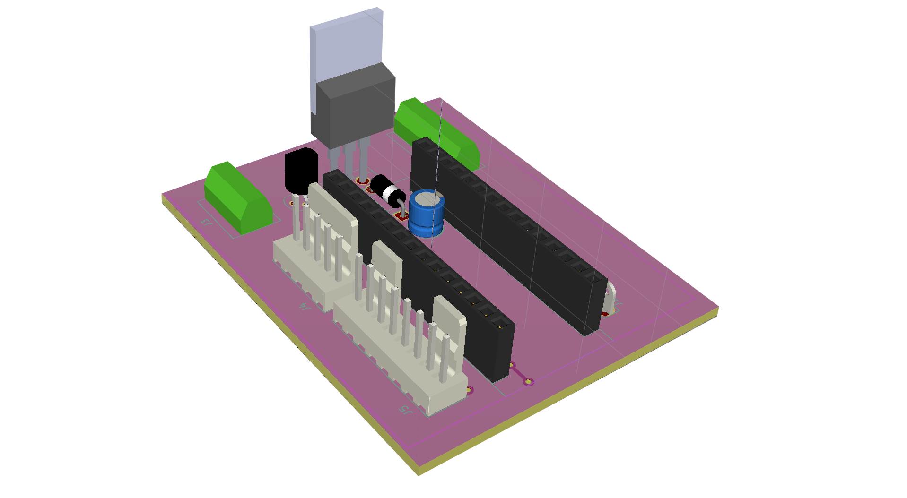
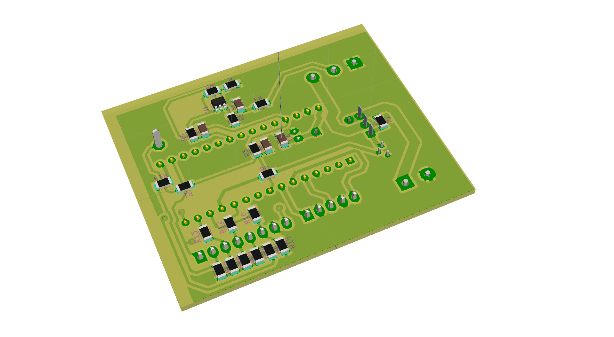

# Arduino-soldering-station
This is a soldering station using Weller RT soldering tips.   
- The project files contains 3D model for the housing and a PCB board using Arduino Nano microcontroller. 
- Source code is written i C, and uses PID library for temperature control. 
- PCB files are generated in KiCad, and include Gerber files. 
 

  

 

This project is based on [ConnyCola](https://github.com/ConnyCola/SolderingStation/tree/master/3D)'s soldering station, but uses a modified source code and 3D model.

The display show the following information:

The display will change colour from Cyan, Yellow, and Green dependent on the difference between SET and ACTual temperature. 
 
 
The SET point will be set to 20 degrees if the soldering tip it placed in the holder, or the selector button is pressed once - Standby mode.  
At the bottom right of the screen, a small bar shows the PWM output in %. 
 

The display will show the temperature curve, repeating approx. every 20 seconds. To enter the Graph mode, the selector switch has to pressed for more than 1 second.

At the bottom left a small dot is showing if the soldering station is in Standby mode.

## PCB

         

## Cirquit diagram

## Credits

The Weller RT product is a trademark of [Weller Tools GmbH](https://www.weller-tools.com/index.html)

The original project is written by [ConnyCola](https://github.com/ConnyCola/SolderingStation/tree/master/3D)

## License

The MIT License (MIT)
